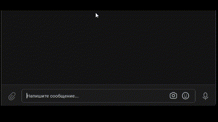
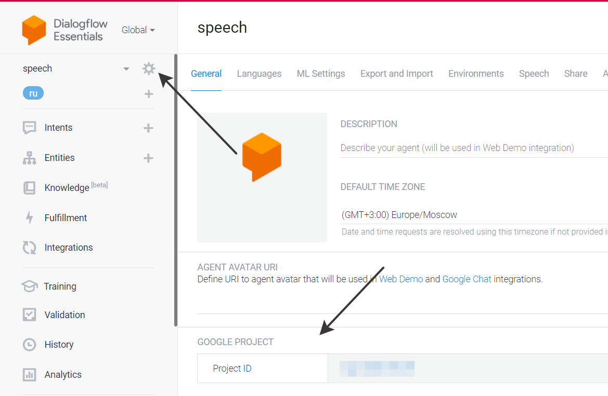
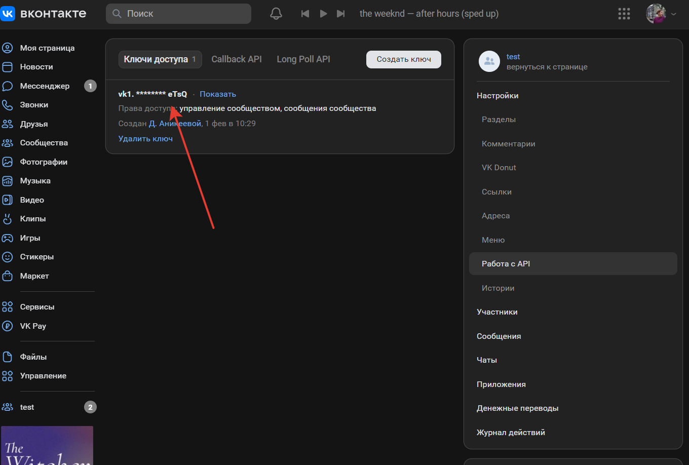
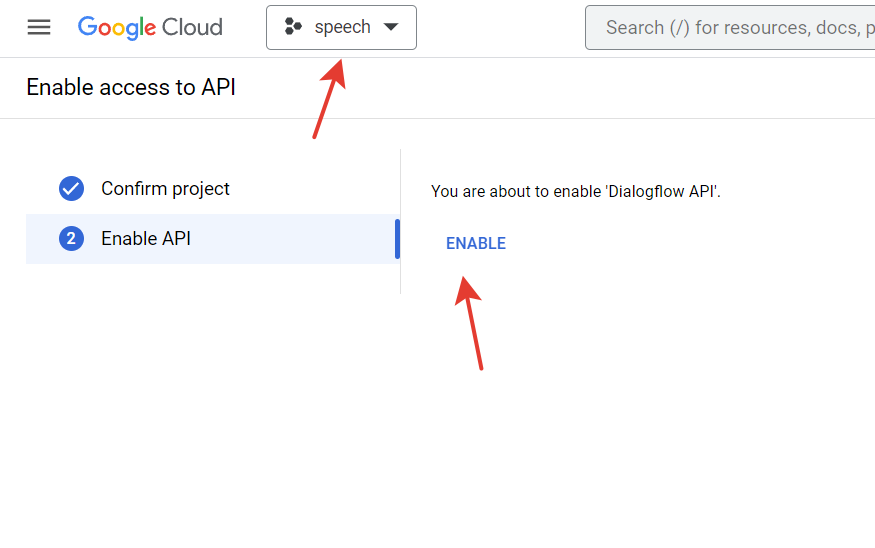

# Распознание речи от пользователя
В коде есть 2 бота: один для `ВКонтакте`, второй для `Телеграма`.



С их помощью, если пользователь задаст вопрос, на который есть стандартный ответ, то бот ответит сам, через неиросеть.
Если же бот не понимает, что написал пользователь, то просто молчит

Вопросы и ответы также можно добавлять, об этом будет сказано ниже

## Для запуска
Скачайте код:
```sh
git clone https://github.com/DarinaAnikeeva/recognize_speech.git
```

[Установите Python](https://www.python.org/), если этого ещё не сделали.

Проверьте, что `python` установлен и корректно настроен. Запустите его в командной строке:
```sh
python --version
```
**Важно!** Версия Python должна быть не ниже 3.6.

Возможно, вместо команды `python` придётся использовать `python3` или `py -3`

В каталоге проекта создайте виртуальное окружение:
```sh
python -m venv venv
```

Активируйте его. На разных операционных системах это делается разными командами:

- Windows: `.\venv\Scripts\activate`
- MacOS/Linux: `source venv/bin/activate`


Установите зависимости в виртуальное окружение:
```sh
pip install -r requirements.txt
```

## Определите переменные окружения.
1. Создать файл `.env` в каталоге и положите туда следующие переменные окружения:
    * `TG_BOT_TOKEN` - необходимо создать телеграмм-бота, https://telegram.me/BotFather напишите команду `/newbot`. В результате создания бота, вам будет прислан примерно такой токен:
```958423683:AAEAtJ5Lde5YYfu8GldVhSG```
    * `PROJECT_ID` - [перейдите по ссылке](https://dialogflow.cloud.google.com/#/getStarted) и нажмите на кнопку [create agent](https://cloud.google.com/dialogflow/es/docs/quick/build-agent). После создания проекта вас будет дан PROJECT ID, его и нужно сюда вставить

    * `GOOGLE_APPLICATION_CREDENTIALS` - положите сюда:
```C:\Users\ultra\AppData\Roaming\gcloud\application_default_credentials.json```, НО нужно сделать следующее: 
   Загрузите [установщик Google Cloud CLI](https://dl.google.com/dl/cloudsdk/channels/rapid/GoogleCloudSDKInstaller.exe), следуйте подсказкам. После установки пишем в командной строке gcloud auth application-default login (создаст джейсон для авторизации по умолчанию, будет находиться)
    * `VK_TOKEN` - [создайте сообщество ВКонтакте](https://vk.com/groups?tab=admin). Токен нужно создать в настройках сообщества в меню `Работа с API`


### Подклюючение API для DialogFlow
[Включить API](https://cloud.google.com/dialogflow/es/docs/quick/setup#api ), убедитесь, что включили для нужного приложения


## Создание нового намерения

Для создания вам необходим `json` файл, в котором находиться тема вопроса, тренировочные фразы и ответ бота
Например:
```
{
    "Устройство на работу": {
        "questions": [
            "Как устроиться к вам на работу?",
            "Как устроиться к вам?",
            "Как работать у вас?",
            "Хочу работать у вас",
            "Возможно-ли устроиться к вам?",
            "Можно-ли мне поработать у вас?",
            "Хочу работать редактором у вас"
        ],
        "answer": "Если вы хотите устроиться к нам, напишите на почту game-of-verbs@gmail.com мини-эссе о себе и прикрепите ваше портфолио."
    }
}
```
Есть 2 варианта создания:
1. запуск команды `python create_intent --url url`, где вместо последнего `url` нужно поставить ссылку на json файл
2. запуск команды `python create_intent --json json`, где вместо последнего `json` вы пишете путь до локального файла в кавычках
Наприемер:
`'D:/my_docyments.../questions.json'` 
или
`'questions.json'` - если вы положили json в проект

**Важно!** в любой новый json не должны входить уже существующие намерения

Не волнуйтесь, если намерения будут долго создаваться. При успешном выполнении вам прийдет сообщение `Complete!` 
